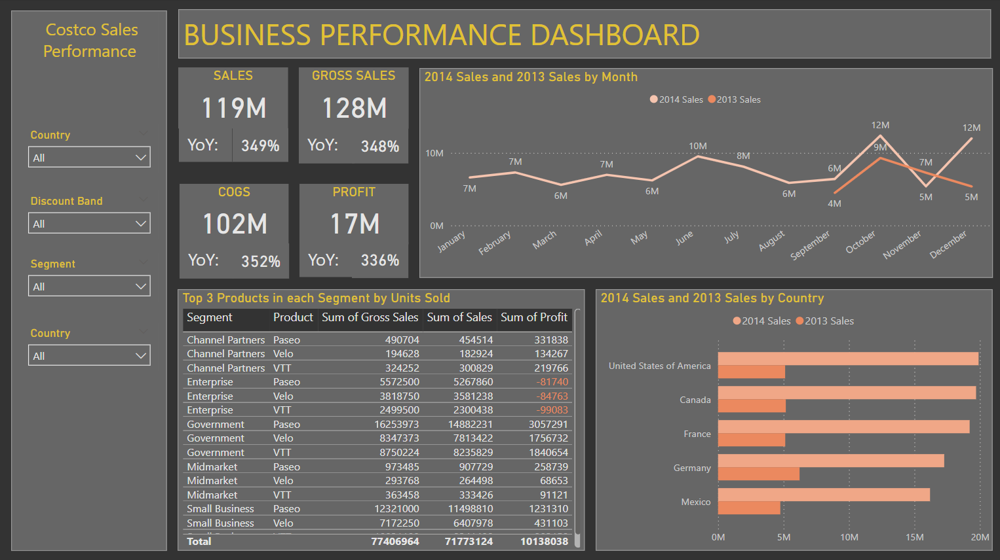

# Client-Sales-Performance-PowerBI-Analysis

## Overview
This Power BI dashboard provides a comprehensive analysis of Costco's sales performance, highlighting key financial metrics, product segment success, and geographic sales distribution over time. Designed to enable stakeholders to quickly gauge business health and operational success, this dashboard serves as a crucial tool for strategic decision-making.

## Key Insights
### Financial Performance Metrics
* Sales Growth: Tracks total sales and gross sales with year-over-year growth percentages, offering a snapshot of overall business growth.
* Profitability Analysis: Analyzes profit margins and cost of goods sold (COGS), with year-over-year changes to assess financial health and operational efficiency.
### Sales Trends Over Time
* Monthly Sales Comparison: Compares monthly sales for the current year against the previous year, helping identify trends, seasonal impacts, and growth trajectories.
* Country-Wise Sales Comparison: Visualizes sales performance across different countries, highlighting which regions are performing well and which may require more attention.
### Product Performance
* Top Products by Segment: Lists the top three products in each segment by units sold, gross sales, sales volume, and profit, providing clear visibility into which products are driving market success.
* Segment Performance Analysis: Breaks down sales and profits by market segments such as Channel Partners, Enterprise, Government, Midmarket, and Small Business, allowing targeted strategic approaches for each market niche.
## Features
* Dynamic Filters: Users can refine the data viewed by applying filters for country, discount band, and market segment, making the dashboard highly adaptable to specific analytical needs.
* Interactive Charts and Tables: Includes interactive elements such as hover details on charts and expandable tables for a more in-depth exploration of the data.
## Usage Instructions
* Navigate the Dashboard: Utilize the tabs and dropdowns to switch between different views such as financial summaries, product details, and geographical sales.
* Apply Filters: Customize the data display by selecting specific countries, discount bands, or segments to focus on areas of interest.
* Interact with Visuals: Hover over graphs and charts to get detailed insights or click on table entries to drill down further into the data.
